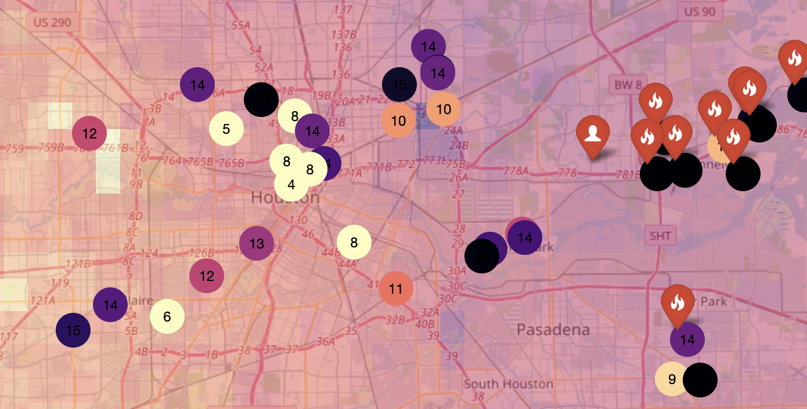
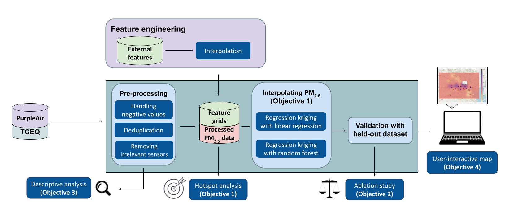
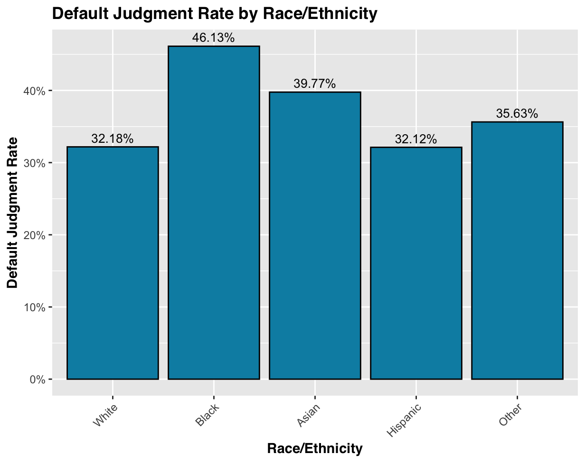
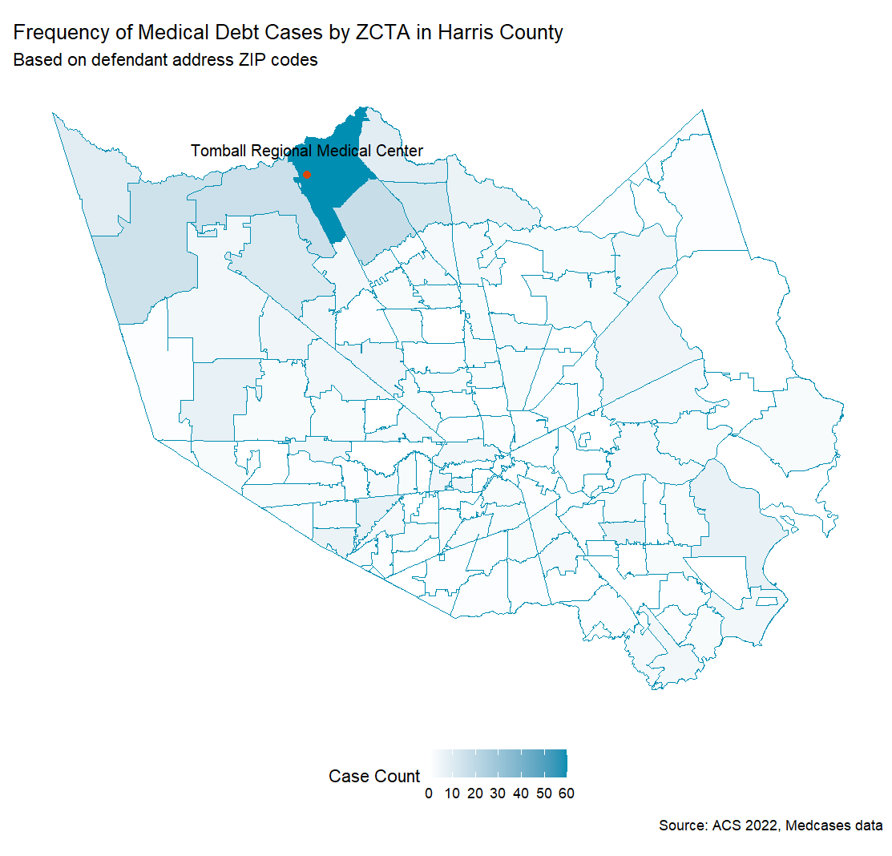

<h1 id="hi-there-i-m-andrew-">Hi there, I&#39;m Andrew!</h1>
<h2 id="_i-like-data-and-policy-_"><em>I like data and policy.</em></h2>

I&#39;m a recent graduate of Rice University, where I studied social policy analysis and data science. Drawing on my experience in quantiative policy research and leading community initiatives, I&#39;m keen to apply my analytical skills to advance democratic, equity-driven policymaking.

<strong>Current Project:</strong> Geospatial and demographic analysis of inequities in NYC historic landmark designation, culminating in public dashboard and toolkit to support community-driven nominations as form of civic representation

<strong>Featured Projects:</strong>
<li>Administration and analysis of nationwide survey (N = 1,792) on U.S. residents' constitutional attitudes in <strong>R</strong>, using factor analysis and multivariate regression to discern multidimensionality of constitutional respect <a href="#veneration">(jump to section)</a></li>
<li>Geospatial interpolation models in <strong>Python</strong> to estimate small particle air pollution in at-risk Houston neighborhoods via map interface for publication by Houston Chronicle <a href="#air-pollution">(jump to section)</a></li>
<li>Gradient-boosted tree and linear regression models in <strong>Python</strong> to predict voter support for and abstentions from U.S. state ballot measures, utilizing web-scraped data (with Selenium and Beautiful Soup) on ballot language, campaign spending, demographics, etc. <a href="#in-pursuit-of-direct-democracy">(jump to section)</a></li>
 

<h1 id="table-of-contents">Table of Contents</h1>
<h3><a href="#democracy">Democracy and Civic Representation Projects</a></h3>
<ul>
  <li><a href="#veneration">Veneration vs. Respect: Reevaluating Public Aversion to Amending the U.S. Constitution</a></li>
  <li><a href="#in-pursuit-of-direct-democracy">In Pursuit of Direct Democracy: Analyzing Predictors of U.S. State Ballot Measure Support and Roll-off</a></li>
  <li><a href="#yes-no-for-against">Yes, No, For, or Against?: How Ballot Measure Wording Impacts Comprehension</a></li>
  <li><a href="#sdr">Evaluating the Impact of Same-Day Voter Registration on 2020 Election Turnout</a></li>
  <li><a href="#biographical-electability">Biographical Electability: Effects of Dishonesty on Political Trust</a></li>
  <li><a href="#bipartisanship">Senate Bipartisanship from 2015-2021</a></li>
</ul>
<h3><a href="#urban">Urban Justice, Health, and Equity Projects</a></h3>
<ul>
  <li><a href="#air-pollution">Filling in the Map: Spatial Interpolation of Small Particle Air Pollution in Houston from Multi-Source Air Quality Data</a></li>
  <li><a href="#medical-debt">Uncovering Medical Debt in the Harris County Judical System</a></li>
  <li><a href="#austin-crime-killer-plot">Analysis of Crime Reports in Austin, TX</a></li>
  <li><a href="#criminal-sentencing">Modeling Criminal Sentencing Disparities in Harris County</a></li>
</ul>
<h3><a href="#personal-projects">Personal Projects</a></h3>
<ul>
  <li><a href="#letterboxd">Letterboxd Rating SQL Analysis</a></li>
</ul>
<h3><a href="#education">Education, Skills, and Work Experience</a></h3>

<h1 id="democracy">Democracy and Civic Representation Projects</h1>

<h3 id="veneration"><ins><a href="https://github.com/andrewdkim7/portfolio/blob/main/DemocracyAndCivicRepresentation/ConstitutionalVeneration.R" target="_blank">Veneration vs. Respect: Reevaluating Public Aversion to Amending the U.S. Constitution (Fall 2023 - Present)</a></ins></h3>
  <li>Recipient of:
    <ul>
      <li>2025 Best Overall Oral Presentation at Rice University's Social Sciences Undergraduate Research Symposium</li>
      <li>2025 Ambler Award for Best Honors Thesis in Political Science</li>
      <li>2024 Hudspeth Award for Best Undergraduate Seminar Paper in Political Science</li>
    </ul></li>
  <li>Independent honors thesis research paper on public attitudes towards federal Constitution and its amendment
  <li>Obtained $3,000 in funding to design and administer nationwide Qualtrics survey of 1,792 U.S. residents
  <li>Cleaned/analyzed responses in <strong>R</strong> with descriptive visualization, factor analysis, and multivariate regression to identify two distinct dimensions of conventional measures of constitutional respect -- symbolic respect and perception of modern relevance
  <li>Identified distinct statistical relationships between each dimension of constitutional respect and constitutional amendment process rigidity level preference, general support for constitutional amendments, political trust, and political knowledge
  <li>Pursuing peer-reviewed journal publication in collaboration with Dr. Robert Stein and Dr. Joseph Cozza

<a href="https://github.com/andrewdkim7/portfolio/blob/main/DemocracyAndCivicRepresentation/reports/VenerationvsRespect_Paper.pdf" target="_blank">Read the full report here!</a>

<h3 id="in-pursuit-of-direct-democracy"><ins><a href="https://github.com/andrewdkim7/portfolio/blob/main/DemocracyAndCivicRepresentation/BallotMeasures.ipynb" target="_blank">In Pursuit of Direct Democracy: Analyzing Predictors of U.S. State Ballot Measure Support and Roll-off (Summer - Fall 2024)</a></ins></h3>
  <li>Web scraped over 2,000 webpages in <strong>Python</strong> for data on U.S. state ballot measures from 2004-2024 (e.g., ballot measure text, campaign finance, state electoral history, voter demographics)
  <li>Cleaned and merged datasets from 9 sources, as well as engineered new predictive features (incl. via textual readability analysis)
  <li>Built gradient-boosted trees to derive high-importance features in predicting ballot measure support and roll-off
  <li>Ran linear regression models and identified significant effects of campaign fundraising on swaying vote share and of ballot text presentation and low-information voter turnout on ballot measure abstentions</li>

<a href="https://github.com/andrewdkim7/portfolio/blob/main/DemocracyAndCivicRepresentation/reports/BallotMeasures_Report.pdf" target="_blank">Read the full report here!</a>

<h3 id="yes-no-for-against"><ins><a href="https://github.com/andrewdkim7/portfolio/blob/main/DemocracyAndCivicRepresentation/YesNoForOrAgainst.R" target="_blank">Yes, No, For, or Against?: How Ballot Measure Wording Impacts Comprehension (Fall 2024)</a></ins></h3>
  <li>Partner research paper on how features of ballot measure wording influence voters' satisfaction with ballot usability and ability to vote according to their true preferences
  <li>Analyzed 430 Qualtrics survey responses in <strong>R</strong> to find that framing maintenance of policy status quo as affirmative vote significantly reduces voting accuracy without conscious perception of increased voting difficulty by voters</li>

<h3 id="sdr"><ins><a href="https://github.com/andrewdkim7/portfolio/blob/main/DemocracyAndCivicRepresentation/SameDayVoterRegistration.R" target="_blank">Evaluating the Impact of Same-Day Voter Registration on 2020 Election Turnout (Fall 2023)</a></ins></h3>
  <li>Simulated hypothetical voter turnout data in 33 U.S. states and conducted difference-in-differences evaluation of same-day voter registration (SDR) policy on electoral turnout in <strong>R</strong>
  <li>Prescribed policy recommendation in favor of SDR based on simulated findings</li>

<a href="https://github.com/andrewdkim7/portfolio/blob/main/DemocracyAndCivicRepresentation/reports/SameDayRegistration_Report.pdf" target="_blank">Read the full report here!</a>

<h3 id="biographical-electability"><ins><a href="https://github.com/andrewdkim7/portfolio/blob/main/DemocracyAndCivicRepresentation/BiographicalElectability.R" target="_blank">Biographical Electability: Effects of Dishonesty on Political Trust (Spring 2023)</a></ins></h3>
  <li>Team research paper exploring effects of electoral candidate’s dishonesty about biographical profile via vignette-based Qualtrics survey of 572 U.S. residents
  <li>Cleaned responses and conducted statistical tests (with poster-ready visualizations) in <strong>R</strong> to evaluate effect of subject of various biographical lies on perceived electability</li>

<a href="https://github.com/andrewdkim7/portfolio/blob/main/DemocracyAndCivicRepresentation/reports/BiographicalElectability_Paper.pdf" target="_blank">Read the full report here!</a>

<h3 id="bipartisanship"><ins><a href="https://github.com/andrewdkim7/portfolio/blob/main/DemocracyAndCivicRepresentation/SenateBipartisanship.R" target="_blank">Senate Bipartisanship from 2015-2021 (Fall 2022)</a></ins></h3>
  <li>Analyzed effect of year and party of U.S. Senators on individual bipartisanship scores with fixed-effects bivariate linear regression in <strong>R</strong>
  <li>Concluded no significant change in bipartisanship between 2015 to 2021 and significantly lower bipartisanship among Democratic Senators</li>

<a href="https://github.com/andrewdkim7/portfolio/blob/main/DemocracyAndCivicRepresentation/reports/SenateBipartisanship_Writeup.pdf" target="_blank">Read the full write-up here!</a>

<h1 id="urban">Urban Justice, Health, and Equity Projects</h1>

<h3 id="air-pollution"><ins><a href="https://github.com/andrewdkim7/portfolio/blob/main/UrbanJusticeHealthAndEquity/reports/AirPollution_Report.pdf" target="_blank">Filling in the Map: Spatial Interpolation of Small Particle Air Pollution in Houston from Multi-Source Air Quality Data (Spring 2025)</a></ins></h3>
  <li>With data team, synthesized Houston air pollution data from governmental and community-based sources to develop geospatial interpolation models (Inverse Distance Weighting, Ordinary Kriging, and Regression Kriging) mapping estimated PM2.5 pollutant concentration levels in locations lacking sensors in <strong>Python</strong>
  <li>Wrangled and interpolated auxiliary datasets to analyze statistical effects of weather, traffic, industrial emissions, and land use on air pollution, concluding high-traffic, high-development, and low-income neighborhoods are at higher risk
  <li>Produced <a href="https://dustbusters.streamlit.app" target="_blank">demo interface</a> enabling users to determine air pollution at own ZIP code and identity pollution hotspots across Houston, supporting development of online tool to be published by Houston Chronicle

<a href="https://github.com/andrewdkim7/portfolio/blob/main/UrbanJusticeHealthAndEquity/reports/AirPollution_Report.pdf" target="_blank">Read the full report here!</a>

<h3 id="medical-debt"><ins><a href="https://github.com/andrewdkim7/portfolio/blob/main/UrbanJusticeHealthAndEquity/MedicalDebt.R" target="_blank">Uncovering Medical Debt in the Harris County Judical System (Fall 2024 - Spring 2025)</a></ins></h3>
  <li><a href="https://github.com/andrewdkim7/portfolio/blob/main/UrbanJusticeHealthAndEquity/MedicalDebtPetitionScraper.ipynb" target="_blank">Automated document query and download process</a> for over 1,000 civil debt lawsuit petitions in <strong>Python</strong> for January Advisors to quantify medical debt incidence in Harris County
  <li>Performed <a href="https://github.com/andrewdkim7/portfolio/blob/main/UrbanJusticeHealthAndEquity/MedicalDebt.R" target="_blank">statistical analysis and visualization</a> of demographic inequities in medical debt burdens and judicial outcomes in <strong>R</strong> to inform research team's policy recommendations urging debt defendant support and court data transparency

<a href="https://github.com/andrewdkim7/portfolio/blob/main/UrbanJusticeHealthAndEquity/reports/MedicalDebt_Report.pdf" target="_blank">Read the full report here!</a>

<h3 id="austin-crime-killer-plot"><ins><a href="https://github.com/andrewdkim7/portfolio/blob/main/UrbanJusticeHealthAndEquity/AustinCrimeKillerPlot.qmd" target="_blank">Analysis of Crime Reports in Austin, TX (Fall 2024)</a></ins></h3>
  <li>Developed presentation-ready visualizations of patterns and potential causes for crime in <strong>R</strong> from 2 million+ row Austin, TX crime report dataset alongside secondary datasets on city demographics and education quality with 3 teammates
  <li>Individually and manually implemented interactive "killer plot" visualization in <strong>R Shiny</strong> with grid library showcasing relative community safety strengths and balances of Austin council districts using standardized measures of school quality, case solve rate, change in crime, and violent crime rate</li>

<a href="https://github.com/andrewdkim7/portfolio/blob/main/UrbanJusticeHealthAndEquity/reports/AustinCrime_Report.pdf" target="_blank">Read the full report here!</a>

<h3 id="criminal-sentencing"><ins><a href="https://github.com/andrewdkim7/portfolio/blob/main/UrbanJusticeHealthAndEquity/HarrisCountySentencingDisparities.ipynb" target="_blank">Modeling Criminal Sentencing Disparities in Harris County (Fall 2024)</a></ins></h3>
  <li>Cleaned Harris County criminal sentencing dataset with over 3 million rows and engineered 9 new features with partner in <strong>Python</strong>
  <li>Built linear regression models to predict sentencing harshness based on charge-related and defendant demographic variables, concluding significant disparities across race, gender, and citizenship status</li>

<a href="https://github.com/andrewdkim7/portfolio/blob/main/UrbanJusticeHealthAndEquity/reports/HarrisCountySentencingDisparities_Report.pdf" target="_blank">Read the full report here!</a>

<h1 id="personal-projects">Personal Projects</h1>
<h3 id="letterboxd"><ins><a href="https://github.com/andrewdkim7/portfolio/blob/main/PersonalProjects/LetterboxdSQLAnalysis.ipynb" target="_blank">Letterboxd Rating SQL Analysis</a></ins></h3>
  <li><a href="PersonalProjects/LetterboxdWebScraping.ipynb" target="_blank">Web scraped 171 webpages w/ <strong>Python</strong></a> for data on films I&#39;ve rated on the Letterboxd film-reviewing platform</li>
  <li>Performed data analysis of various datasets in <strong>SQL</strong> to uncover personal film-watching/-rating trends, comparisons to other Letterboxd users, and characteristics of highly-rated films to inform future film selection</li>
 

<h1 id="education">Education</h1>

<strong>Rice University <em>(2021 - 2025)</em></strong> <em>3.95 GPA (cum laude)</em> Social Policy Analysis, BA Managerial Economics and Organizational Studies, BA Political Science, BA Data Science, Minor Spanish, Minor

<strong>Relevant Coursework</strong> Applied Machine Learning &amp; Data Science Projects • Data Science Tools &amp; Models • Machine Learning for Data Science • R for Data Science • Probability &amp; Statistics for Data Science • Applied Econometrics • Applied Research Methods in Political Science • Survey Research in American Politics

<h3 id="skills">Skills</h3>

<strong>Technical Skills</strong> Python • R • SQL • Tableau • Git • AWS • Microsoft Suite • Qualtrics • HTML/CSS • Statistics/Econometrics • CRMs

<strong>Technically Skills</strong> Spanish (CEFR-) • Building Escape Rooms • Writing Satire

<h1 id="work">Technical Work Experience</h1>
<h3 id="trilogy">Trilogy Interactive - Digital Production Fellow (Summer 2022)</h3>
  <li>Built emails and online landing pages in <strong>HTML/CSS</strong> for progressive political campaigns to email lists of 550,000+ users using CRMs incl. Mailchimp, EveryAction, Acoustic 
  <li>Analyzed email/social media performance in Excel and drafted reports w/ content recommendations, updating existing data cleaning workflow for improved accuracy</li>